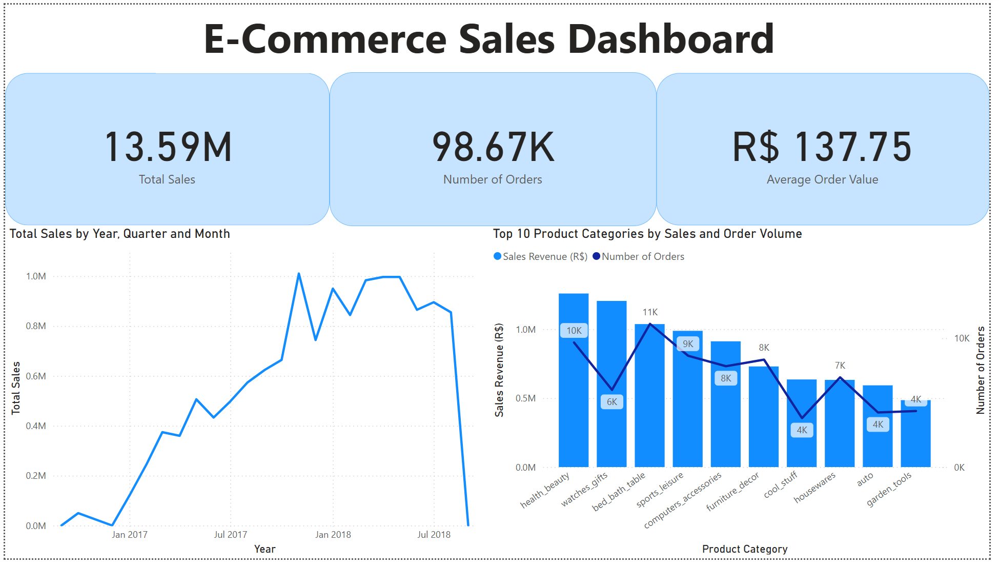
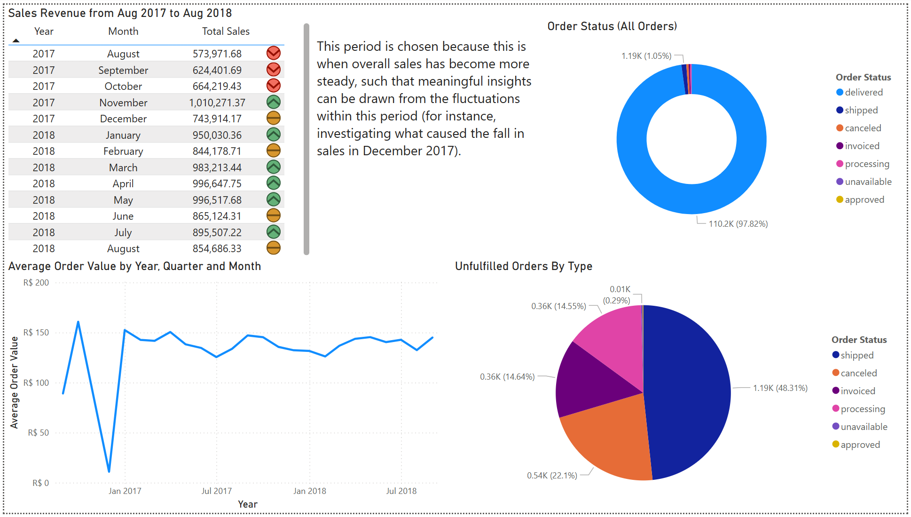
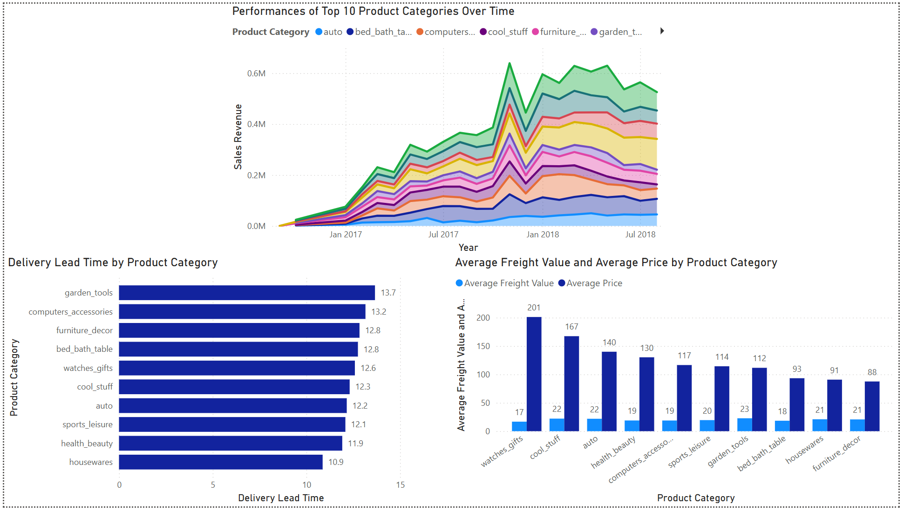

# 📊 Brazilian E-Commerce Dashboard (Power BI Project)

This project visualizes key business metrics from the [Brazilian E-Commerce Public Dataset by Olist](https://www.kaggle.com/datasets/olistbr/brazilian-ecommerce), offering a comprehensive view of sales performance, order status, product insights, and operational efficiency over time.

---

## 📌 Overview

The report is built in Power BI and consists of **three interactive pages**:

### 🔹 Page 1: Business Overview
This page presents a high-level summary of key performance indicators and trends:

- **Cards:**
  - **Total Sales**
  - **Number of Orders**
  - **Average Order Value (AOV)**

- **Visualizations:**
  - 📈 *Total Sales by Year, Quarter, and Month* (Line Chart)
  - 📊 *Top 10 Product Categories by Sales and Order Volume* (Column and Line Combo Chart)

---

### 🔹 Page 2: Sales Analysis

Focused on sales activity and fulfillment status during the core period of: 

- **Table:** Monthly sales revenue **from August 2017 to August 2018**
- **Line Chart:** Trend of *Average Order Value* over time
- **Doughnut Chart:** Distribution of *order status* among all orders
- **Pie Chart:** Breakdown of *unfulfilled orders* (e.g., shipped, canceled)

---

### 🔹 Page 3: Product Deep Dive

This page highlights the top 10 performing products and their operational dynamics:

- **Stacked Area Chart:** Sales performance over time of the top 10 products
- **Bar Chart:** Delivery lead time for top products
- **Clustered Column Chart:** Comparison of *average freight value* and *average product price*

---

## 📈 Dataset Source

- **Title:** Brazilian E-Commerce Public Dataset by Olist  
- **Link:** [https://www.kaggle.com/datasets/olistbr/brazilian-ecommerce](https://www.kaggle.com/datasets/olistbr/brazilian-ecommerce)  
- **Time Period Covered:** 2016–2018  
- **Records:** 100k+ orders and related product, customer, review, and seller data
